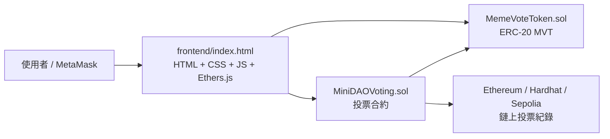

# Mini DAO Voting System

迷你去中心化投票站是一個教學型 Web3 專題。系統發行沒有實際價值的 ERC-20 治理代幣 MemeVote Token，讓使用者依照持有的 MVT 數量投票，並把投票結果永久記錄在區塊鏈上。

## 專案特色

- ERC-20 代幣投票權：1 MVT = 1 Vote
- MetaMask 錢包登入
- 鏈上建立投票、投票、查詢結果、關閉投票
- 每個錢包每個投票只能投一次
- Owner 才能關閉投票
- 純 HTML5、CSS3、JavaScript ES6、Ethers.js 前端
- 支援 Hardhat Local Network 與 Sepolia Testnet

## 系統架構圖



## 專案目錄

```text
mini-dao-voting/
  contracts/
    MemeVoteToken.sol
    MiniDAOVoting.sol
  scripts/
    deploy.js
  frontend/
    index.html
    style.css
    app.js
    config.js
    abi/
  test/
    MiniDAOVoting.test.js
  artifacts/
  hardhat.config.js
  package.json
  README.md
  .env.example
```

## 安裝教學

```bash
cd mini-dao-voting
npm install
```

## Hardhat 設定

`hardhat.config.js` 已設定：

- `hardhat`：內建測試網路，Chain ID `31337`
- `localhost`：本機節點 `http://127.0.0.1:8545`
- `sepolia`：Sepolia 測試網，需設定 `.env`

## .env 設定

複製 `.env.example` 成 `.env`：

```bash
cp .env.example .env
```

填入：

```env
SEPOLIA_RPC_URL=https://sepolia.infura.io/v3/YOUR_PROJECT_ID
PRIVATE_KEY=0xYOUR_DEPLOYER_PRIVATE_KEY
```

注意：不要把 `.env` 或私鑰提交到 Git。

## 編譯流程

```bash
npx hardhat compile
```

## 測試流程

```bash
npx hardhat test
```

測試內容包含：

- Token 名稱、符號、小數位、初始鑄造
- 建立投票
- 依照 MVT 餘額計算投票權重
- 防止重複投票
- 防止零餘額投票
- Owner 權限關閉投票
- 關閉後禁止投票
- ERC-20 轉帳

## 部署流程

### 部署前端到 Vercel

Vercel 會執行 `npm run build`，把 `frontend/` 複製到 `dist/` 並發布靜態網站。

```bash
npm run build
vercel --prod
```

如果要讓 Vercel 上的網站連到 Sepolia 合約，請在 Vercel 環境變數設定：

```env
MVT_TOKEN_ADDRESS=0xYOUR_SEPOLIA_TOKEN_ADDRESS
MINI_DAO_VOTING_ADDRESS=0xYOUR_SEPOLIA_VOTING_ADDRESS
CHAIN_ID=11155111
NETWORK_NAME=sepolia
```

### 部署到 Hardhat Local Network

終端機 1：

```bash
npx hardhat node
```

終端機 2：

```bash
npx hardhat run scripts/deploy.js --network localhost
```

部署腳本會：

1. 部署 `MemeVoteToken`
2. 部署 `MiniDAOVoting`
3. 建立一個範例投票「下一次聚餐吃什麼？」
4. 產生 `frontend/config.js`
5. 產生 `frontend/abi/*.json`

### 部署到 Sepolia

確認 `.env` 已設定後執行：

```bash
npx hardhat run scripts/deploy.js --network sepolia
```

## MetaMask 設定

### Hardhat Local Network

在 MetaMask 新增自訂網路：

- Network Name：Hardhat Local
- RPC URL：`http://127.0.0.1:8545`
- Chain ID：`31337`
- Currency Symbol：`ETH`

接著把 `npx hardhat node` 顯示的任一測試帳號私鑰匯入 MetaMask。

### Sepolia Testnet

切換 MetaMask 到 Sepolia，並確認錢包有 Sepolia ETH 作為 Gas fee。

## 使用教學

1. 啟動本機節點：`npx hardhat node`
2. 部署合約：`npx hardhat run scripts/deploy.js --network localhost`
3. 用 Live Server 開啟 `frontend/index.html`
4. 點擊 `Connect Wallet`
5. 查看 Wallet Address、Network、Token Balance
6. 在 Create Poll 建立投票
7. 點擊 Poll List 的投票卡片
8. 選擇選項並按 `Vote`
9. 在 Result 區塊查看即時結果與百分比
10. 使用 Token Transfer 發送 MVT 給其他帳號
11. Owner 可按 `Close Poll` 關閉投票

## 合約功能說明

### MemeVoteToken.sol

- Token Name：`MemeVote Token`
- Symbol：`MVT`
- Decimals：`18`
- 初始供給：`1,000,000 MVT`
- 部署時自動 Mint 給部署者
- 支援 ERC-20 標準轉帳
- Owner 可額外 Mint 測試代幣

### MiniDAOVoting.sol

主要資料：

- `pollId`
- `title`
- `description`
- `options`
- `voteCounts`
- `isClosed`
- `totalVotes`

主要功能：

- `createPoll`：建立投票活動
- `vote`：依照投票當下 MVT 餘額投票
- `closePoll`：Owner 關閉投票
- `getPoll`：取得單一投票完整資料
- `getAllPolls`：取得所有投票摘要
- `getOptionVoteCount`：取得指定選項票數
- `hasVoted`：查詢錢包是否已投票
- `isPollClosed`：查詢投票是否已關閉

事件：

- `PollCreated(uint256 pollId, string title)`
- `Voted(uint256 pollId, address voter, uint256 optionIndex, uint256 voteWeight)`
- `PollClosed(uint256 pollId)`

## 前端功能說明

Header：

- Logo
- 專案名稱
- Connect Wallet
- Wallet Address
- Network
- Token Balance

Hero Section：

- Token-Based Voting Platform 介紹
- ERC-20 Voting
- MetaMask Login
- On-chain Storage
- Tamper Proof

Create Poll：

- Title
- Description
- Option 1 到 Option 4
- Create Poll

Poll List：

- Title
- Description
- Status
- Total Votes
- 卡片式呈現

Vote：

- 顯示投票選項
- Vote 按鈕
- 已投票或已關閉時自動停用

Result：

- Progress Bar
- 百分比
- 票數

Token Transfer：

- Receiver Address
- Amount
- Send Token

## 錯誤處理

前端會顯示友善 Toast 提示：

- MetaMask 未安裝
- 錢包未連接
- 合約地址尚未設定
- 餘額不足
- 已投票
- 投票已結束
- 非 Owner 關閉投票
- 交易取消
- 交易失敗
- 網路或 RPC 錯誤

## 安全性設計

- 使用 OpenZeppelin ERC20
- 使用 OpenZeppelin Ownable
- `hasVoted[pollId][wallet]` 防止同一錢包同一投票重複投票
- `onlyOwner` 防止未授權關閉投票
- 關閉投票後禁止繼續投票
- 投票權重在投票當下由 `balanceOf` 讀取
- 所有投票結果寫入鏈上，不依賴前端本地資料

## 一鍵流程摘要

```bash
npm install
npx hardhat compile
npx hardhat test
npx hardhat node
npx hardhat run scripts/deploy.js --network localhost
```

完成後開啟 `frontend/index.html`，即可使用 MetaMask 登入、查看 MVT 餘額、建立投票、參與投票、查看結果與發送測試代幣。
